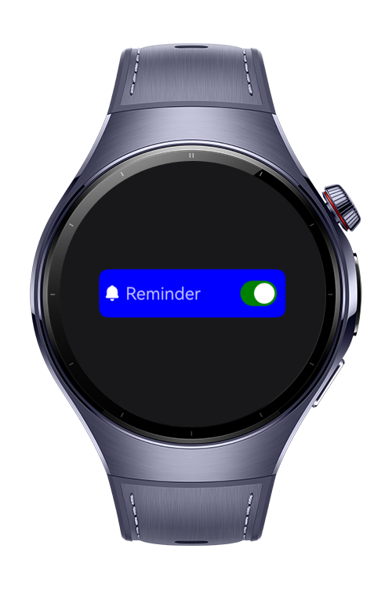

> **Note:** To access all shared projects, get information about environment setup, and view other guides, please visit [Explore-In-HMOS-Wearable Index](https://github.com/Explore-In-HMOS-Wearable/hmos-index).

# How to use notification

This codelab shows how to create reminders and send notifications using Agent-Powered Reminders.

# Preview
<div>

</div>

# Use Cases
- create reminder
- show notifications

# Technology
## Stack

- **Languages**: ArkTS, ArkUI
- **Frameworks**: HarmonyOS SDK 5.1.0(18)
- **Tools**: DevEco Studio Vers 5.1.1.823
- **Libraries**:
  - @kit.NotificationKit
  - @kit.BackgroundTasksKit

## Required Permissions
  - ohos.permission.PUBLISH_AGENT_REMINDER

# Directory Structure

```
\entry\src\main\ets
├───entryability        
│       EntryAbility.ets
├───entrybackupability  
│       EntryBackupAbility.ets
├───pages
│       Index.ets
└───viewmodel
        Reminder.ets
```
# Constraints and Restrictions
## Supported Device
- Huawei Watch 5

# LICENSE
**Smart Home** is distributed under the terms of the MIT License.
See the [license](LICENSE) for more information. 
